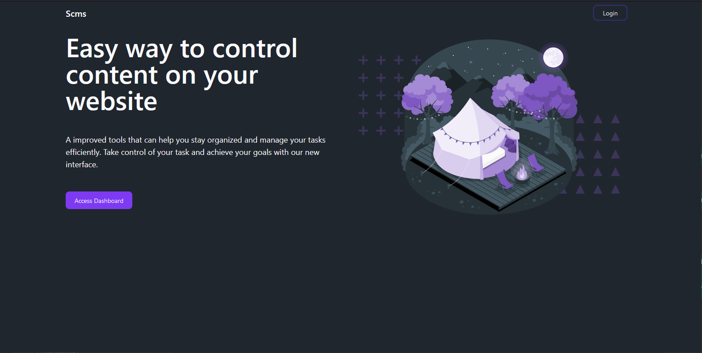
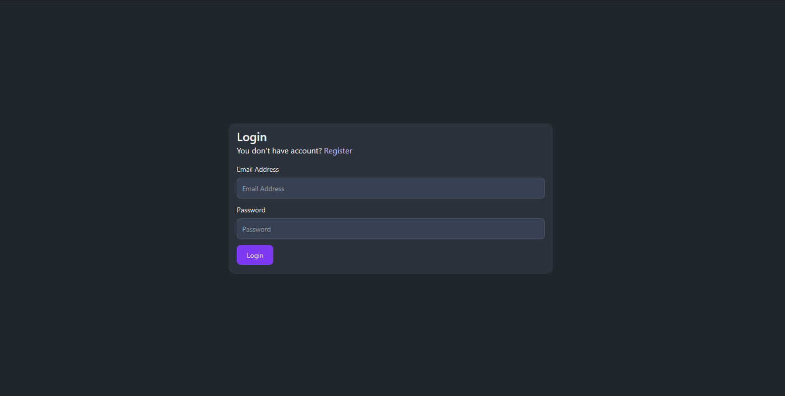

## Kiryuu Storage Content Management System

### Getting Started

First, run the development server:

```bash
npm run dev
```

Changes: 

#### Homepages



#### Authorization (Login, Register, Email Verification)

